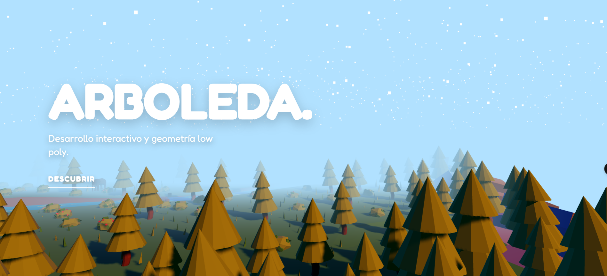
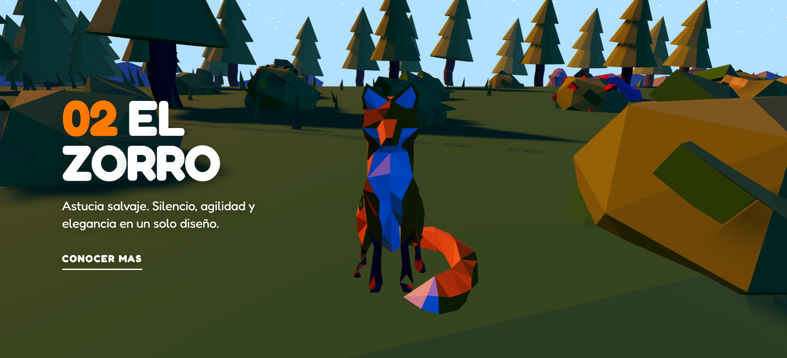

# Arboleda

Proyecto inmersivo en 3d que busca mostrar el funcionamiento de modelos 3d en la web con Vue3, utilizando [Three.js](https://threejs.org/) y [GSAP](https://greensock.com/gsap/).

## Instalación

```bash
npm install
```

## Ejecución

```bash
npm run dev
```

## Screenshots




